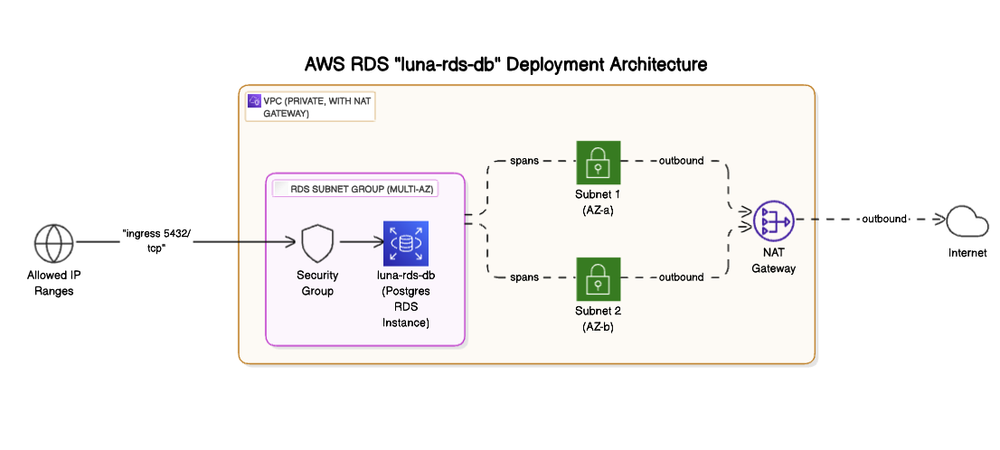
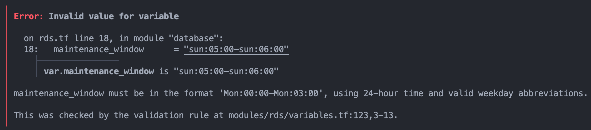
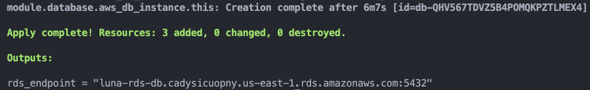
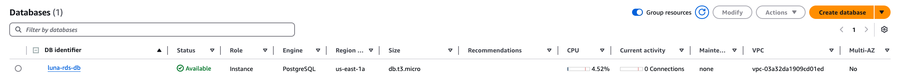
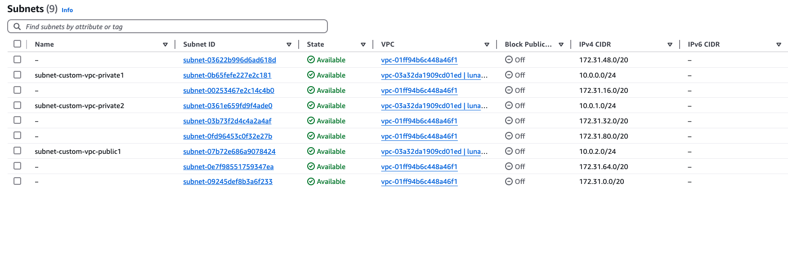

# Postgres RDS Database instance with automated backups




### What is this project?

This project is an AWS RDS database running the Postgres engine. One of the best aspects of this project is 
that I built it as a module, so it's perfect to integrate it into other projects or to continue expanding it.

The module contains an excellent precedent for user input validation, perfect to be expanded upon in a 
production application. Finally, it contains automated backups, ensuring data security.


### What are the project’s components?

1. RDS database
2. AWS DB subnet group
    - Allows the database instance to communicate with other resources within the private VPC. 
    This allows resources to communicate while simultaneously keeping them secure.
3. Virtual Private Cloud (VPC)
    - Uses default VPC, change if you want to use this code on a production application.
4. AWS subnets
5. VPC security group rules
6. In-depth resource creation validation
    - I created a series of validations at the network level, and also for the variables users are 
    allowed to provide. The validations greatly decrease the probability of human error.
7. VPC security group ingress rules.


### Project deployed

Input validation, decreasing likelihood of human error


`Apply complete!`


Database available in AWS


Two public subnets and one public (public subnet **cannot** be attached to VPC)



### How to: Run this on my machine/cloud?

1. Clone the resource you need
2. Make whatever changes you need to my config
3. Run:
```sh
    terraform init
    terraform apply
```

### Key things I learned building this project

* AWS RDS instances **MUST** be in different availability zones (AZs). If you try to create 
an RDS instance in the same AZ you'll get an error.
* Always provide a description for module resources 😅


