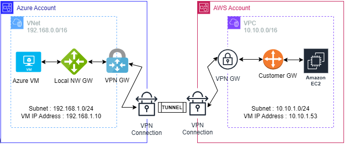
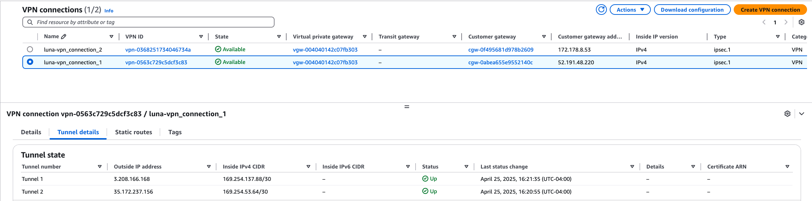
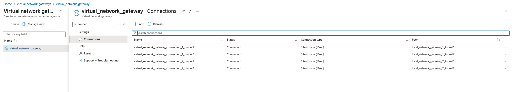
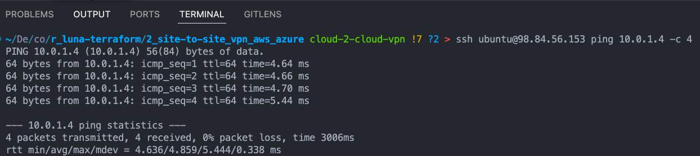

# Terraform Site-to-Site (S2S) VPN Between AWS and Azure




## What is this project?
A Site-to-Site (S2S) VPN between cloud providers (AWS and Azure) lets you securely extend 
private networks across both clouds over the public Internet. Instead of exposing resources 
directly to the world, it uses IPsec tunnels _(high availability)_ that encrypt traffic between 
the AWS VPC and the Azure Virtual Network (VNet).

**Common uses:**

- **Hybrid-Multi-Cloud Networking:** Connect on-prem data centers or other clouds (e.g. GCP) 
through AWS and Azure to centralize services.
- **Disaster Recovery & Backup:** Replicate databases or storage snapshots securely between 
clouds for fail-over scenarios.
- **Cross-Cloud Bursting:** Offload excess compute in Azure when AWS capacity is maxed (or vice-versa)
while keeping the same private IP schemes.
- **Shared Services Hub:** Host common services (Active Directory, logging, monitoring) in one 
cloud and consume them privately from the other.
- **Regulatory or Data-Residency Requirements:** Keep sensitive data in one region/cloud while 
processing workloads in another, without exposing traffic to the public Internet.
- **Multi-Region, Multi-Cloud Resilience:** Architect truly fault-tolerant systems that can 
survive a cloud outage by rerouting traffic to the other provider via the VPN.

## What are the project’s components?

### AWS Side
**Virtual Private Gateway (VGW)**
* Acts as the AWS VPN terminator, attached directly to the VPC.
* Hosts two IPsec tunnel endpoints (for HA) that peer with Azure.


**Customer Gateway (CGW)**
* A Terraform-defined object pointing at each of the Azure VPN Gateway’s public IPs.
* Provides AWS with the remote endpoint IP and (optionally) a BGP ASN.


**VPN Connections**
* Two connections (one per CGW) of type `ipsec.1`, each establishing an independent tunnel.
* Can be configured for **static routes** or **BGP** to exchange VPC routes with Azure dynamically.

### Azure Side

**Virtual Network Gateway**
* Deployed in a dedicated `GatewaySubnet` of the VNet.
* Route-Based SKU (e.g. VpnGw1) running in **active-active** mode across two public IPs for resilience.


**Local Network Gateway**
* Azure’s representation of our AWS VPN endpoints—one per AWS tunnel.
* Stores the AWS public IP address and the VPC’s CIDR(s) so Azure knows where to send traffic.


**Connection Objects**
* One per AWS tunnel, binding the VNet Gateway to each Local Network Gateway.
* Carry the shared key, IKE/IPsec policy (encryption, hashing, DH group), and routing method (static or BGP).


**IPsec Tunnel Lifecycle**

1. IKE Phase 1
* Peers authenticate with the shared secret and negotiate a secure channel.

2. IKE Phase 2
* Negotiates the actual IPsec SAs that encrypt and authenticate our packets.

3. Data Flow
* Encrypted packets travel from AWS VGW → Internet → Azure VNet Gateway (and vice-versa).


**Routing Between Clouds**
Static Routing
You list each remote CIDR (e.g. AWS’s _192.168.1.0/24_, Azure’s _10.0.1.0/24_) in both connection configs.


**Dynamic Routing (BGP)**
* BGP peers over each tunnel exchange all routes automatically.
* Provides better fail-over: if one tunnel drops, BGP withdraws routes and traffic switches over.

**High Availability (HA) & Fail-Over**
**_Dual-Tunnel, Dual-Connection_**

* AWS spins up two VPN connections; Azure runs two tunnels on an active-active gateway.
* If one path or AZ goes down, traffic seamlessly shifts to the healthy tunnel.


**End-to-End Traffic Flow**
1. **AWS VM → VPC subnet:** packet hits the VGW.
2. **VGW → IPsec tunnel:** encrypt & send over Internet to Azure.
3. **Azure Gateway → VNet:** decrypt & inject into Azure subnet.
4. **Azure VM** receives the packet on its private IP (10.0.x.x).

And vice-versa for Azure VM → AWS VM traffic.

## Project deployed

AWS Shows both VPN connections **UP**



Azure shows Virtual Network Gateways connections **Connected**



Pinging a private VM on Azure using the public IP on AWS


```sh
    Apply complete! Resources: 1 added, 0 changed, 0 destroyed.

    Outputs:

    aws_vm_private_ip = "192.168.1.188"
    aws_vm_public_ip = "98.84.56.153"
    azure_vm_private_ip = "10.0.1.4"
    azure_vm_public_ip = "52.226.113.68"

    # From AWS
     > ssh ubuntu@98.84.56.153 ping 10.0.1.4 -c 4                    
    PING 10.0.1.4 (10.0.1.4) 56(84) bytes of data.
    64 bytes from 10.0.1.4: icmp_seq=1 ttl=64 time=5.59 ms
    64 bytes from 10.0.1.4: icmp_seq=2 ttl=64 time=5.80 ms
    64 bytes from 10.0.1.4: icmp_seq=3 ttl=64 time=5.20 ms
    64 bytes from 10.0.1.4: icmp_seq=4 ttl=64 time=5.78 ms

    --- 10.0.1.4 ping statistics ---
    4 packets transmitted, 4 received, 0% packet loss, time 3005ms
    rtt min/avg/max/mdev = 5.196/5.590/5.797/0.241 ms

    # From inside the VM

    ubuntu@ip-192-168-1-188:~$ ping -c 4 10.0.1.4
    PING 10.0.1.4 (10.0.1.4) 56(84) bytes of data.
    64 bytes from 10.0.1.4: icmp_seq=1 ttl=64 time=5.29 ms
    64 bytes from 10.0.1.4: icmp_seq=2 ttl=64 time=6.46 ms
    64 bytes from 10.0.1.4: icmp_seq=3 ttl=64 time=6.26 ms
    64 bytes from 10.0.1.4: icmp_seq=4 ttl=64 time=5.22 ms
    
    ubuntu@ip-192-168-1-188:~$ nc -vz 10.0.1.4 22
    Connection to 10.0.1.4 22 port [tcp/ssh] succeeded!
```

## How to: Run this on my machine/cloud?

**Requirements**
These requirements assume you are successfully connected to your AWS and Azure accounts.

Terraform ~> 1.7
Public key


## Key things I learned building this project

1. Azure does not support setting a global location, like AWS does; to achieve something similar, 
one has to use a variable, or a local (I dislike both methods 😅)
2. I learned some key differences between AWS and Azure.
