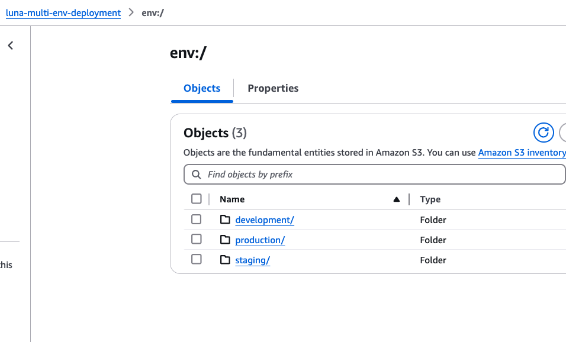

# Multi-Environment Deployment: Development, Staging, and Production

## What is this project?

This project deploys three sets of AWS resources to simulate managing three distinct 
environments—a common standard in production applications. The project uses Terraform 
[workspaces](https://developer.hashicorp.com/terraform/language/state/workspaces) to 
isolate state for each environment.

## Environment breakdown

* **Development**: The engineer’s local machine, where software is built, bugs are fixed, 
and initial testing occurs.

* **Staging**: A pre-production environment designed for final QA and peer review (PR). 
Staging closely mirrors production infrastructure, enabling realistic tests of how code
will behave in production.

* **Production**: The live environment where end users interact with the software.

To ensure high code quality, all changes must pass a peer-review (PR) before being 
deployed to staging. A dedicated staging environment gives QA teams a safe space to 
test changes and provides confidence that they’ll work as expected in production.

Terraform workspaces let us break our infrastructure into isolated state units. The 3 
workspaces—`development`, `staging`, and `production` use the same codebase & resources:

* **development**: 1 S3 bucket
* **staging**: 2 S3 buckets
* **production**: 3 S3 buckets

## Key benefits

1. **DRY code**
We reuse the same Terraform modules across all environments, adjusting only the parameters each needs.

2. **Safety**
Changes in development and staging never impact production, so you can experiment freely without risk.

3. **Reduced maintenance**
A single, parameterized codebase is far easier to maintain than multiple, environment-specific scripts.

4. **Cleaner, simpler code**
Less duplication means configuration files stay concise and easier to understand.

5. **Lower complexity**
Fewer lines of code make it easier to locate and update infrastructure components—even years later.

6. **Environment parity**
Ensures development, staging, and production use the exact same configuration (aside from parameter values), 
drastically reducing “it works on my machine” issues.

7. **CI/CD friendliness**
Many pipelines (GitHub Actions, Jenkins, GitLab CI, etc.) natively support Terraform workspaces, 
so you can automate plan/apply steps per branch or tag, making continuous delivery smoother.


## What are the project’s components?

There are 3 env variable files: 
1. development.tfvars
2. staging.tfvars
3. production.tfvars 

They modify the name of the resources (adding clarity) and the number of existing resources. For example: the development bucket is called `luna-assets-1-development-aecac228`, which indicates that it is a development bucket. Meanwhile, one of the production buckets is called `luna-assets-1-production-5c591f78`. This aids the user in distinguishing what workspace this resource belongs to at a glance. 


## Project deployed

#### State separation for each deployment environment



#### Development, staging, and production deployments & matching workspaces


#### Created assets per deployment


## How to: Run this on my machine/cloud?

1. Create a bucket to store your backend state.
2. Replace the name of the bucket state on `providers.tf`. 
3. Create the workspaces (`development`, `staging`, and `production`).
3. Run the following commands:

```sh
	terraform init # initialize project
	terraform apply # Create infrastructure
```

## What I learned while building this project

There is a useful command that can help us avoid mistakes while simplifying infrastructure creation/update. 

```sh
	terraform apply -var-file=$(terraform workspace show).tfvars
```

`terraform workspace show` - lists the name of the current workspace, e.g. `production`. While on that workspace,
that configuration file will always be applied if we named our env var `production.tfvars`. 
